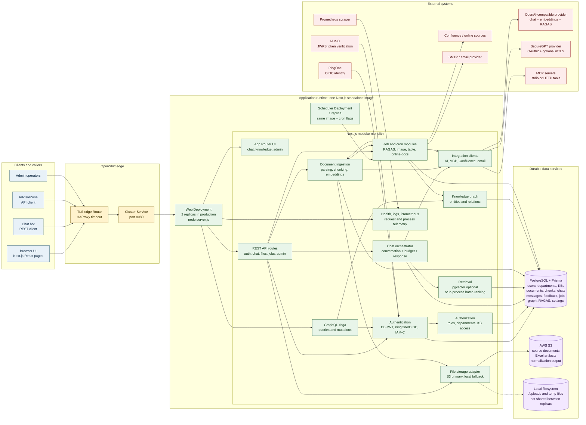
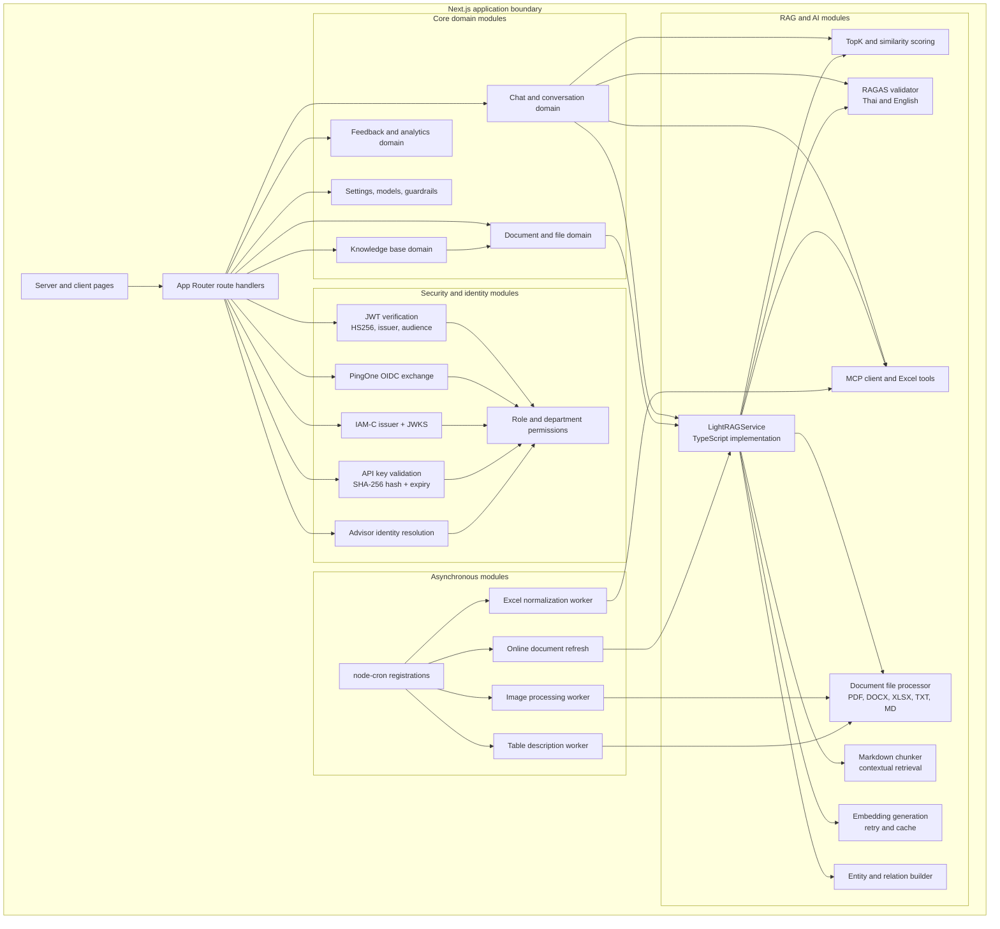
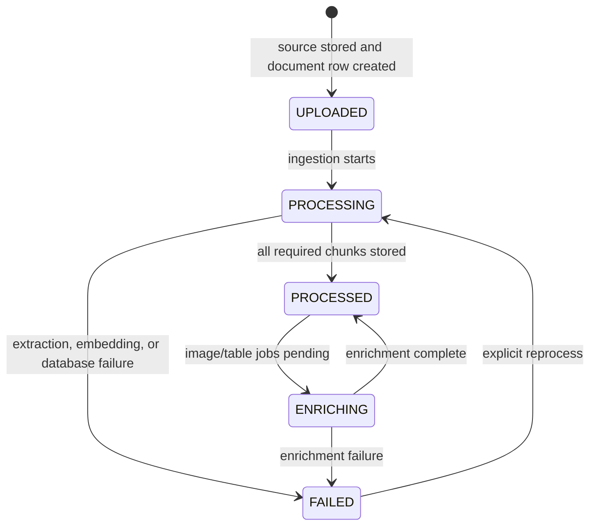
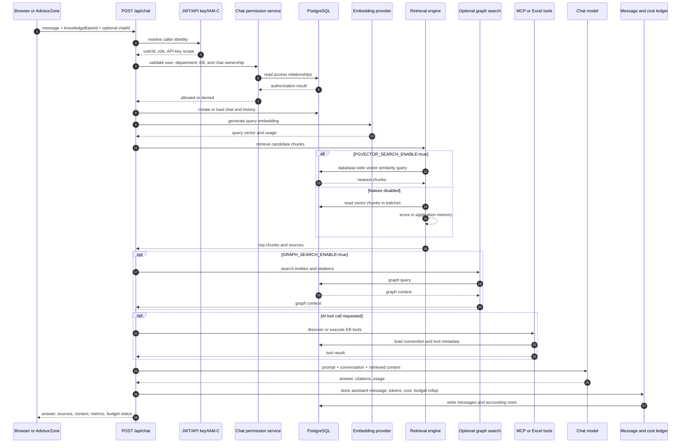
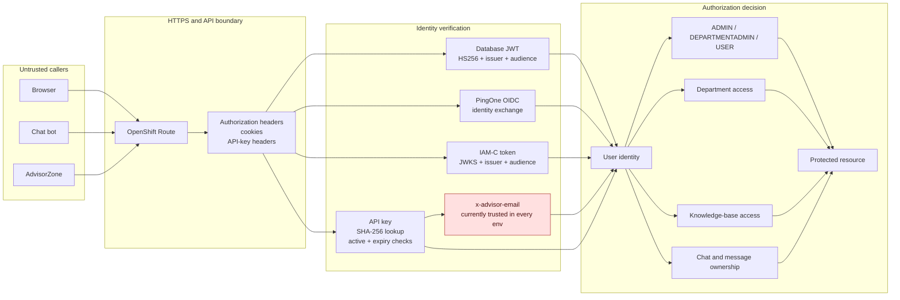
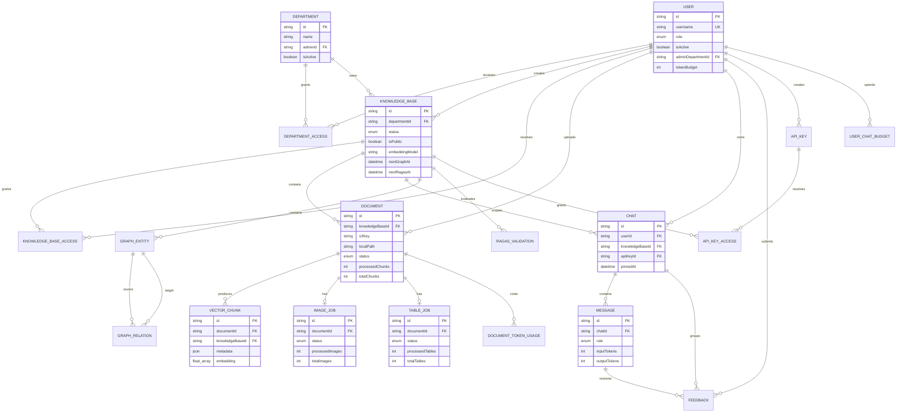
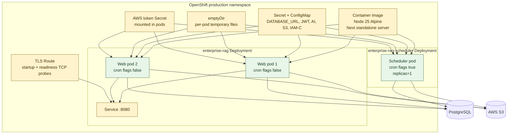
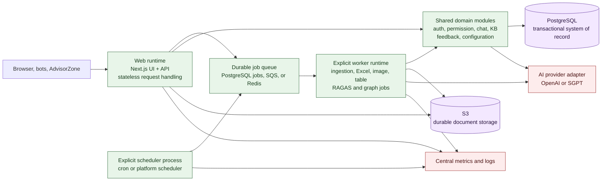

# Enterprise LightRAG - Current System Diagram

> Current-state architecture for the repository. This document separates the implemented runtime from the recommended modular-monolith target shape.
>
> The application is a TypeScript LightRAG implementation inside a Next.js App Router application. It is not a Python LightRAG service and it is not currently decomposed into independently deployed domain services.

## 1. Primary System View



### Runtime interpretation

- The web deployment is horizontally scalable for HTTP traffic, but each replica has its own in-memory caches and rate-limit state.
- The scheduler is a separate OpenShift deployment, but it uses the same container image and relies on cron initialization from application module loading.
- Initial document ingestion and some Excel processing run from the web request process. Image and table processing use database job rows and scheduler polling.
- PostgreSQL is the system of record for authorization, metadata, vectors, chat history, jobs, graph data, and quality results.
- S3 is the intended production file store. Local storage is a fallback and is not shared across web replicas.

## 2. Application Module View



## 3. Document Ingestion and Enrichment

```mermaid
sequenceDiagram
    autonumber
    participant Caller as Browser or API caller
    participant Upload as POST /api/upload
    participant Auth as Auth + permission checks
    participant Store as FileStorageService
    participant DB as PostgreSQL
    participant RAG as LightRAGService
    participant Parser as File processor + chunker
    participant AI as AI provider
    participant Cron as Scheduler cron
    participant Worker as Image/table workers
    participant Object as S3 or local filesystem

    Caller->>Upload: multipart file + KB/department
    Upload->>Auth: verify JWT or role
    Auth->>DB: verify user, department, KB access
    Auth-->>Upload: authorized
    Upload->>Store: save source file
    Store->>Object: PutObject or local write
    Store->>DB: create document row
    DB-->>Store: document id
    Store-->>Upload: document id and storage reference
    Upload-)RAG: start processAndStoreDocument without waiting
    Upload-->>Caller: accepted; poll document status

    RAG->>Store: read source file
    Store->>Object: GetObject or local read
    Object-->>Store: file bytes
    Store-->>RAG: file bytes
    RAG->>Parser: extract text, images, tables
    Parser-->>RAG: normalized markdown and metadata
    RAG->>Parser: chunk markdown and apply contextual retrieval
    Parser-->>RAG: chunks
    loop Each embedding batch
        RAG->>AI: generate embeddings
        AI-->>RAG: vectors and usage
        RAG->>DB: write vector_chunks and token usage
    end
    RAG->>DB: create image/table job rows when required
    RAG->>DB: update document and KB status

    Cron->>DB: find pending image/table jobs
    Worker->>DB: atomically claim a job
    Worker->>Object: read source document
    Worker->>AI: vision or table-description calls
    AI-->>Worker: derived descriptions
    Worker->>DB: write derived chunks and progress
    Worker->>DB: mark job and document status

    Cron->>DB: find scheduled RAGAS, graph, retention, online-doc work
    Cron->>AI: RAGAS or graph model calls when enabled
    Cron->>DB: store validation, graph, schedule, and audit state
```

### Ingestion states



## 4. Chat and Retrieval Flow



## 5. Authentication and Trust Boundaries



**Boundary note:** The diagram shows the intended authorization decision. The repository still contains route-level gaps, including unauthenticated chat history GET access, unscoped document status access, unscoped upload GET access, and GraphQL resolvers that do not consistently enforce context authorization.

## 6. Data Domain Map



## 7. OpenShift Runtime Topology



### Current deployment properties

| Boundary | Current behavior | Architectural consequence |
|---|---|---|
| Web replicas | Two pods share PostgreSQL and S3 | HTTP scaling is possible, but local caches and rate limits diverge |
| Scheduler | One pod, same image, environment-gated cron | Duplicate work is avoided by topology, not a general leader-election mechanism |
| Initial ingestion | Started from the upload request process | A web pod restart can interrupt processing |
| Image/table jobs | Database rows plus polling workers | More durable; workers can claim jobs atomically |
| Local files | Per-pod filesystem and `emptyDir` | Not a production source of truth in a multi-replica deployment |
| Vector search | Application-side fallback when pgvector flag is false | Retrieval cost grows with corpus size and pod memory |
| Readiness | TCP probe only | Pod can accept traffic while dependencies or application features are unhealthy |
| Metrics | Public Prometheus route with default process metrics | Requires network policy and domain-specific metrics for operations |

## 8. Recommended Modular-Monolith Target

This is the recommended evolution without splitting business domains into microservices.



The first operational split should be the worker boundary, not separate services for chat, users, knowledge bases, or authorization. Those domains currently share transaction boundaries and should remain in one application until scale or ownership requires otherwise.

## 9. Source Map

The diagram is based on these implementation surfaces:

- [Next.js route handlers](../src/app/api/)
- [Chat API and RAG orchestration](../src/app/api/chat/route.ts)
- [TypeScript LightRAG service](../src/lib/lightrag.ts)
- [File storage adapter](../src/lib/fileStorage.ts)
- [AI provider configuration](../src/lib/aiProviderConfig.ts)
- [OpenAI-compatible client](../src/lib/aiClient.ts)
- [SecureGPT client](../src/lib/sgptClient.ts)
- [MCP client](../src/lib/mcpClient.ts)
- [Image processing worker](../src/lib/imageProcessingWorker.ts)
- [Table description worker](../src/lib/tableDescriptionWorker.ts)
- [Cron modules](../src/app/cron/)
- [Prisma data model](../prisma/schema.prisma)
- [OpenShift runtime template](../infrastructure-oc4/run-time/openshift-template.yml)
- [Production parameters](../infrastructure-oc4/prod.params)
- [Container build](../Dockerfile)
- [Health endpoint](../src/app/api/health/route.ts)
- [Prometheus endpoint](../src/app/api/prometheus/metrics/route.ts)

## 10. Architecture Status

The repository has the foundations of a modular monolith: a shared domain model, a common authorization layer, durable PostgreSQL metadata, S3 integration, and separable worker logic. The current implementation still needs explicit worker startup, durable initial ingestion, consistent authorization enforcement, deterministic database migrations, and production-grade shared rate limiting before the topology can be treated as a reliable production architecture.
